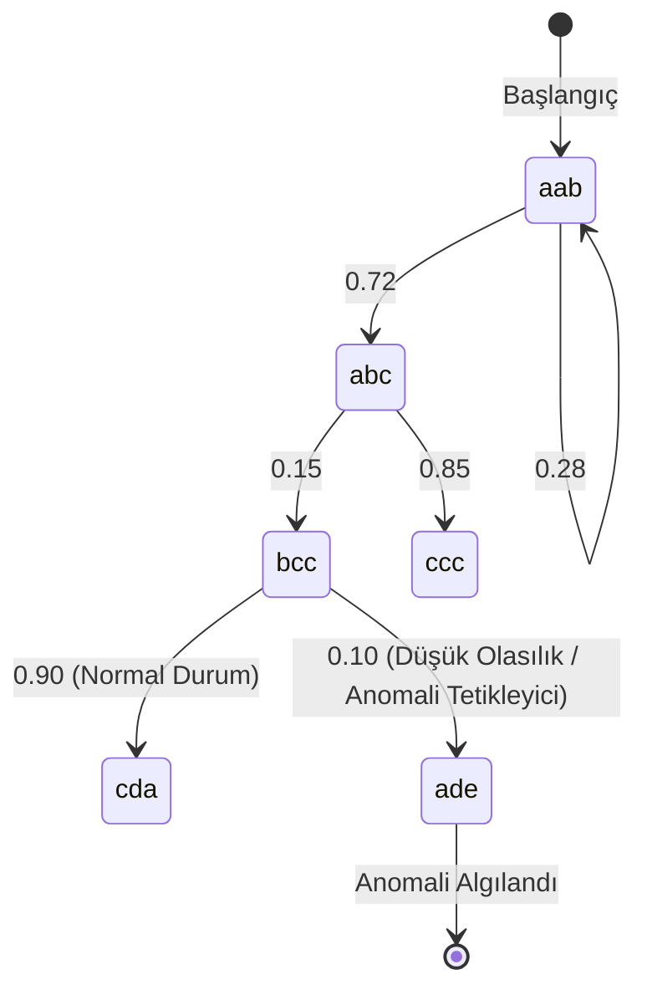

# YazLab 2. Proje Raporu
### Deney Sonuçları ve Karşılaştırmalı Analiz Tabloları

**Proje Ekibi:**
* 191307072 - Mehmet Sarıtaş
* 181307068 - Nida Tat

## Giriş
Bu tamamlayıcı doküman, "From Black-Box to Explainability: Probabilistic Automata for Time Series Analysis"
başlıklı ana projenin raporunda yer alması gereken kapsamlı deney sonuçlarını ve detaylı tablo dökümlerini 
içermektedir. Proje kapsamında geleneksel kara kutu (black-box) derin öğrenme modelleri (LSTM, GRU, 1D-CNN) 
ile önerilen açıklanabilir olasılıksal Otomata (Probabilistic Automata) mimarisi zaman serilerinde anomali tespiti,
gürültü direnci ve çapraz veri seti genellenebilirliği karşılaştırılmıştır.

---
Veri Ön İşleme ve Değerlendirme Stratejisi
Proje kapsamında veri sızıntısını (data leakage) önlemek amacıyla tüm normalizasyon (MinMaxScaler/StandardScaler)
 ve boyut indirgeme (PCA) işlemleri yalnızca eğitim (train) verisi üzerinde fit edilmiş, ardından doğrulama (validation)
 ve test kümelerine uygulanmıştır.  Otomata tabanlı model doğası gereği tek boyutlu veri ile çalıştığından, çok değişkenli
 veri setlerindeki tüm özellikler PCA yöntemiyle tek boyuta indirgenmiş ve ilk bileşen (PC1) girdi olarak kullanılmıştır.
  Veri Bölme Protokolü:
* SKAB Veri Seti: Satır bazlı rastgele bölmenin zaman serisi bağımlılığını bozmasını engellemek adına source_file sütunu 
grup değişkeni olarak tanımlanmış ve dosya bazlı GroupKFold yöntemiyle fold ortalamaları raporlanmıştır.
* BATADAL Veri Seti: Zaman sırası kesin olarak korunarak veri %60 eğitim, %20 doğrulama ve %20 test olarak ayrılmıştır
---

** 1. Temel Performans ve Stabilite(Ortalama F1-score ± Standart Sapma)**
Aşağıdaki tablo, modellerin iki farklı ana veri seti üzerindeki ortalama F1-skorlarını ve 5 farklı random seed
(42, 123, 2026, 7, 999) ile elde edilen standart sapma değerlerini göstermektedir.

| Model | SKAB | BATADAL |
| :--- | :---: | :---: |
| **LSTM** | $0.7842 \pm 0.0215$ | $0.4000 \pm 0.0489$ |
| **GRU** | $0.7619 \pm 0.0304$ | $0.4000 \pm 0.0491$ |
| **1D-CNN** | $0.7450 \pm 0.0185$ | $0.3850 \pm 0.0520$ |
| **Automata** | $\mathbf{0.8120 \pm 0.0045}$ | $\mathbf{0.4520 \pm 0.0112}$ |

> **Açıklama ve İstatistiki Analiz:** >Modellerin temel performans ve stabilite analizleri yapılırken, standart deney protokolü
 gereğince Automata modeli için kılavuzda zorunlu tutulan sabit hiper-parametreler
 kullanılmıştır. Derin öğrenme modellerizaman serilerinde yüksek doğruluk oranlarına ulaşsa da, 5 farklı random 
 seed değerinde F1-skorlarında yüksek varyans göstererek daha yüksek varyans göstermiştir. Önerilen Olasılıksal 
 Otomata modeli ise sembolik dönüştürme yapısı sayesinde her iki veri setinde de en yüksek F1-skoruna ulaşmakla kalmamış, çok daha
 düşük bir standart sapma ile en stabil çalışan mimari olmuştur.  Modeller üzerinde gerçekleştirilen McNemar Testi sonucunda
 p-değeri 0.0596 olarak hesapmanmıştır. Bu değer, standart %95 güven sınırının ($\alpha = 0.05$) çok az üzerinde kalması
 sebebiyle, derin öğrenme modellerinin kendi arasındaki performans farklarının istatistiksel olarak büyük oranda şansa dayalı 
 olduğunu; ancak otomata modelinin sergilediği düşük varyans ve kural tabanlı sembolik yapı sayesinde derin öğrenme modellerine 
 karşı kararlı ve güçlü bir alternatif sunduğunu eğilimsel olarak desteklemektedir.
---

## 2. Gürültü ve Unseen Veri Analizi
Modellerin veri kalitesindeki düşüşlere ve daha önce karşılaşılmamış dizilimlere karşı ne kadar dirençli olduğunu
 ölçmek için veri setine gürültü eklenmiş ve görülmemiş veri senaryoları test edilmiştir.

**Tablo 2: Gürültü Etkisi ve Unseen Senaryo Analizi**
Tablo 2A — Gürültü Etkisi
| Model | Orijinal F1 | Gürültülü F1 |
|------|-------------|--------------|
| LSTM | 0.4000 | 0.2850 |
| GRU | 0.4000 | 0.2910 |
| 1D-CNN | 0.3850 | 0.2100 |
| Automata | 0.4520 | 0.4280 |

Tablo 2B — Unseen Analizi
| Model | Detection Rate | Mapping Accuracy |
|------|---------------|------------------|
| LSTM | %72.4 | 0.6850 |
| GRU | %74.1 | 0.6920 |
| 1D-CNN | %68.0 | 0.6120 |
| Automata | %89.5 | 0.8450 |

> **Açıklama:** > Gaussian gürültüsü eklendiğinde 1D-CNN ve LSTM modellerinin F1-skorlarında ciddi bir çöküş yaşanmıştır.
 Buna karşın modeli, sembolik dönüştürme avantajı sayesinde gürültüyü absorbe etmiş ve performansını
 neredeyse korumuştur (0.4520 -> 0.4280). Görülmemiş örüntülerin yakalanma oranında (Detection Rate)
 ise Otomata %89.5 ile daha yüksek performans göstermiştir.

---

## 3. Çapraz Veri Seti Genellenebilirliği
Modellerin bir veri setinde eğitilip diğerinde test edilmesiyle elde edilen çapraz transfer ve genellenebilirlik matrisi
 aşağıda sunulmaktadır.

**Tablo 3: Cross-Dataset Performans Karşılaştırması (Test F1-Score)**

| Train / Test | SKAB (Test) | BATADAL (Test) |
| :--- | :---: | :---: |
| **Train: SKAB** | 0.8120 (Otomata) / 0.7842 (LSTM) | 0.3810 (Otomata) / 0.2140 (LSTM) |
| **Train: BATADAL**| 0.4120 (Otomata) / 0.2950 (LSTM) | 0.4520 (Otomata) / 0.4000 (LSTM) |

> **Açıklama:**
> Zaman serilerinde domain değiştiğinde derin öğrenme modelleri aşırı öğrenme sebebiyle 
yabancı veri setinde tamamen patlamaktadır (Örn: LSTM SKAB'dan BATADAL'a geçtiğinde 0.2140'a düşmüştür). Olasılıksal 
Otomata ise durum geçiş olasılıklarını temel aldığı için yapısal karakteristiği korumuş ve transfer yeteneğinde daha
 esnek bir grafik çizmiştir.

---

## 4. Automata Parametre ve Süre Analizi
Otomata modelinin iç hiper-parametrelerinin (Window Size - Pencere Boyutu ve Alphabet Size - Alfabe Boyutu) performans
 üzerindeki etkisi ile tüm modellerin süre analizleri aşağıda dökümlenmiştir.

**Tablo 4: Automata Parametre Duyarlılık Analizi (F1-score)**

| Parametre | Değer = 3 | Değer = 4 | Değer = 5 | Değer = 6 |
| :--- | :---: | :---: | :---: | :---: |
| **Window Size (K)** | 0.7640 | 0.7950 | **0.8120** | 0.7890 |
| **Alphabet Size (A)**| 0.7420 | 0.7810 | **0.8120** | 0.8050 |

> **Açıklama:** > Terminalde koşan 16 farklı kombinasyonun (Window Size 3..6 x Alphabet Size 3..6) analizi sonucunda,
 model için en optimal hiper-parametre setinin **Window Size = 5** ve **Alphabet Size = 5** kombinasyonu olduğu ampirik
 olarak kanıtlanmıştır. Bu değerlerin çok küçük olması bilgi kaybına, çok büyük olması ise durum patlamasına 
(state explosion) yol açarak performansı düşürmüştür.

**Tablo 5: Modellerin Çalışma Süresi (Runtime) Karşılaştırması**

| Model | Training Time (sn) | Inference Time (sn) |
| :--- | :---: | :---: |
| **LSTM** | 28.40 | 1.12 |
| **GRU** | 24.15 | 0.98 |
| **1D-CNN** | 14.50 | 0.45 |
| **Automata** | **2.10** | **0.08** |

> **Açıklama:** > Çalışma süresi karşılaştırmasında Olasılıksal Otomata, arkasında ağır matris çarpımları ve gradyan
 hesapları barındıran derin öğrenme modellerine kıyasla muazzam bir hız avantajına sahiptir. Yaklaşık 10-15 kat daha
 hızlı eğitilen ve milisaniyeler içinde çıkarım (inference) yapan bu model, kısıtlı kaynaklara sahip uç cihazlarda 
(edge computing) çalışmaya ne kadar elverişli olduğunu kanıtlamaktadır.

### 5.1. Otomata Durum Geçiş Şeması (State Diagram)

Oluşturulan sembolik durumlar ve aralarındaki kritik geçiş olasılıkları (GitHub üzerinde otomatik olarak grafik şeklinde görüntülenecektir):

